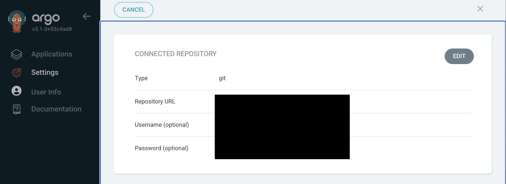
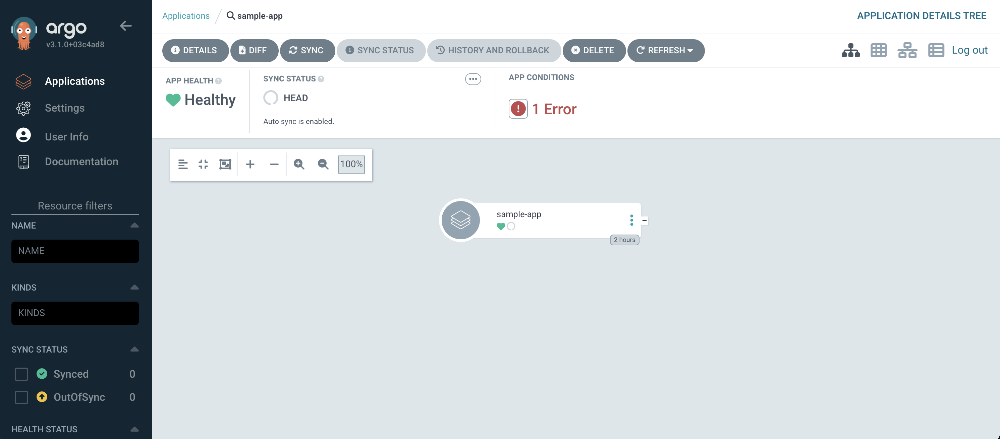
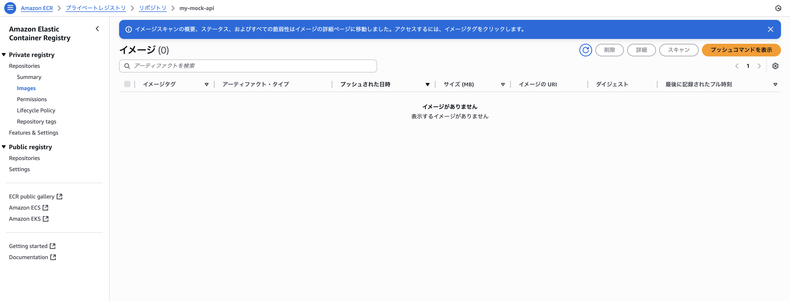
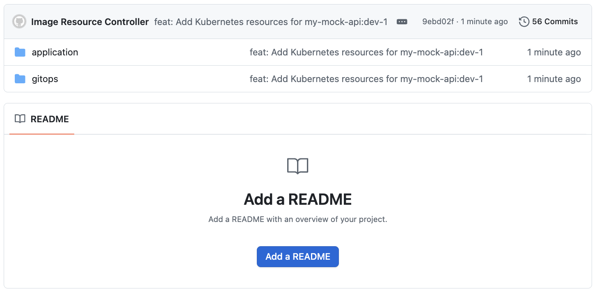
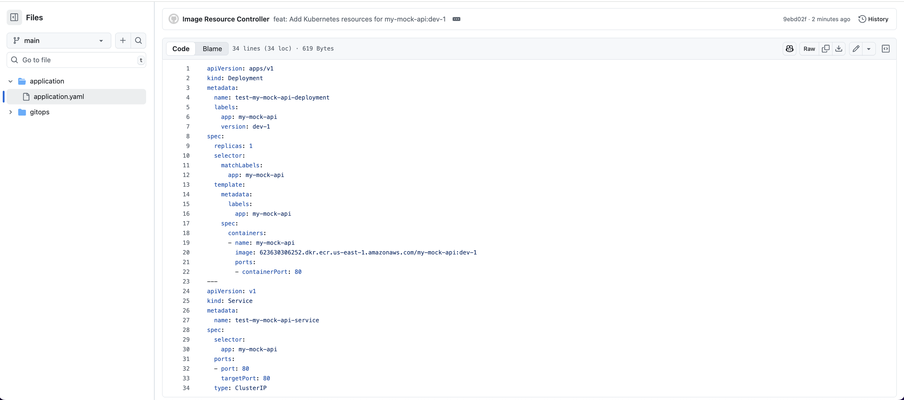
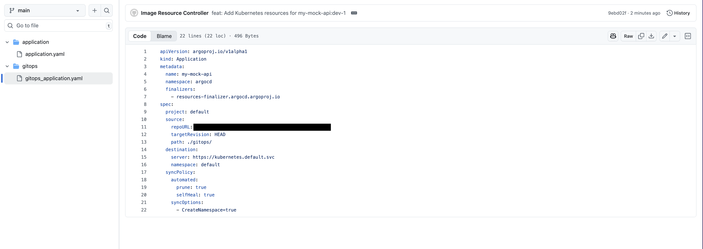
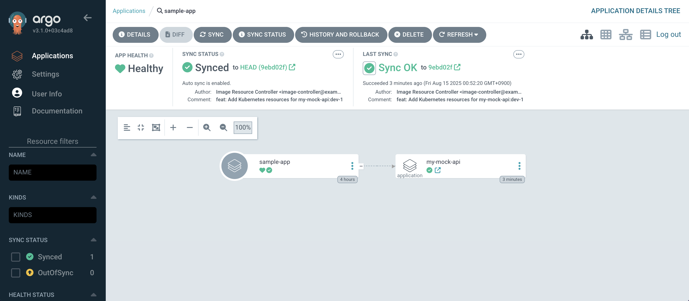

# image-resource-controller-argocd-sandbox

## 概要

このリポジトリでは、[image-resource-controller](https://github.com/S-mishina/image-resource-controller)の使い方をArgocdを例にしてまとめます。

## 利用するもの

* [kind](https://kind.sigs.k8s.io/)
  * Kubernetesをローカル環境で動かす
* [ArgoCD](https://argo-cd.readthedocs.io/en/stable/)
  * GitOpsツール
* [image-resource-controller](https://github.com/S-mishina/image-resource-controller)
  * 今回紹介するカスタムオペレーター
* [open-api-mock-build](https://github.com/S-mishina/open-api-mock-build)
  * imageを生成するツール

## 公開想定するユースケース

開発者が任意のタイミングでk8s上にMockserverを作りたいというユースケース

## 環境構築

今回は[image-resource-controller](https://github.com/S-mishina/image-resource-controller)のMakeコマンド使って環境を立ち上げ、そこにArgoCDを別途でインストールするような形で環境を作ります。

### (1). リポジトリのインストール

```bash:bash
git clone git@github.com:S-mishina/image-resource-controller.git
```

### (2). 環境構築

```bash:bash
arm64⚡️ ~/ghq/github.com/S-mishina/image-resource-controller  git: main  AWS: tcpip | ap-northeast-1 GCP: dev
 ❯ make kind-create
kind create cluster --name image-resource-controller
Creating cluster "image-resource-controller" ...
 ✓ Ensuring node image (kindest/node:v1.27.3) 🖼 
 ✓ Preparing nodes 📦  
 ✓ Writing configuration 📜 
 ✓ Starting control-plane 🕹️ 
 ✓ Installing CNI 🔌 
 ✓ Installing StorageClass 💾 
Set kubectl context to "kind-image-resource-controller"
You can now use your cluster with:

kubectl cluster-info --context kind-image-resource-controller

Not sure what to do next? 😅  Check out https://kind.sigs.k8s.io/docs/user/quick-start/
```

```bash:bash
[kind-image-resource-controller|default] 
arm64⚡️ ~/ghq/github.com/S-mishina/image-resource-controller  git: main  AWS: tcpip | ap-northeast-1 GCP: xxx
 ❯ make kind-dev
docker build -t image-detection-controller:latest -f Dockerfile.detection .
[+] Building 19.6s (17/17) FINISHED                                                   docker:desktop-linux
 => [internal] load build definition from Dockerfile.detection                                        0.0s
 => => transferring dockerfile: 1.32kB                                                                0.0s
 => [internal] load .dockerignore                                                                     0.0s
 => => transferring context: 197B                                                                     0.0s
 => [internal] load metadata for gcr.io/distroless/static:nonroot                                     1.5s
 => [internal] load metadata for docker.io/library/golang:1.23                                        2.9s
 => [builder 1/9] FROM docker.io/library/golang:1.23@sha256:60deed95d3888cc5e4d9ff8a10c54e5edc008c6a  0.0s
 => => resolve docker.io/library/golang:1.23@sha256:60deed95d3888cc5e4d9ff8a10c54e5edc008c6ae3fba618  0.0s
 => CACHED [stage-1 1/3] FROM gcr.io/distroless/static:nonroot@sha256:cdf4daaf154e3e27cfffc799c16f34  0.0s
 => [internal] load build context                                                                     0.0s
 => => transferring context: 93.01kB                                                                  0.0s
 => CACHED [builder 2/9] WORKDIR /workspace                                                           0.0s
 => CACHED [builder 3/9] COPY go.mod go.mod                                                           0.0s
 => CACHED [builder 4/9] COPY go.sum go.sum                                                           0.0s
 => CACHED [builder 5/9] RUN go mod download                                                          0.0s
 => CACHED [builder 6/9] COPY cmd/ cmd/                                                               0.0s
 => CACHED [builder 7/9] COPY api/ api/                                                               0.0s
 => [builder 8/9] COPY internal/ internal/                                                            0.0s
 => [builder 9/9] RUN CGO_ENABLED=0 GOOS=linux GOARCH=arm64 go build -a -o manager cmd/detection/ma  16.4s
 => [stage-1 2/3] COPY --from=builder /workspace/manager .                                            0.1s
 => exporting to image                                                                                0.1s
 => => exporting layers                                                                               0.1s
 => => writing image sha256:5b48c72eb1027dfcb317796dcd88e03124d737b7fa184e7c43b103e20373bc68          0.0s
 => => naming to docker.io/library/image-detection-controller:latest                                  0.0s

View build details: docker-desktop://dashboard/build/desktop-linux/desktop-linux/qasn74asam44tml3xoyukfjpt

What's Next?
  View a summary of image vulnerabilities and recommendations → docker scout quickview
docker build -t resource-creation-controller:latest -f Dockerfile.creation .
[+] Building 17.3s (17/17) FINISHED                                                   docker:desktop-linux
 => [internal] load build definition from Dockerfile.creation                                         0.0s
 => => transferring dockerfile: 1.32kB                                                                0.0s
 => [internal] load .dockerignore                                                                     0.0s
 => => transferring context: 197B                                                                     0.0s
 => [internal] load metadata for gcr.io/distroless/static:nonroot                                     0.4s
 => [internal] load metadata for docker.io/library/golang:1.23                                        0.4s
 => CACHED [stage-1 1/3] FROM gcr.io/distroless/static:nonroot@sha256:cdf4daaf154e3e27cfffc799c16f34  0.0s
 => [builder 1/9] FROM docker.io/library/golang:1.23@sha256:60deed95d3888cc5e4d9ff8a10c54e5edc008c6a  0.0s
 => => resolve docker.io/library/golang:1.23@sha256:60deed95d3888cc5e4d9ff8a10c54e5edc008c6ae3fba618  0.0s
 => [internal] load build context                                                                     0.0s
 => => transferring context: 2.38kB                                                                   0.0s
 => CACHED [builder 2/9] WORKDIR /workspace                                                           0.0s
 => CACHED [builder 3/9] COPY go.mod go.mod                                                           0.0s
 => CACHED [builder 4/9] COPY go.sum go.sum                                                           0.0s
 => CACHED [builder 5/9] RUN go mod download                                                          0.0s
 => CACHED [builder 6/9] COPY cmd/ cmd/                                                               0.0s
 => CACHED [builder 7/9] COPY api/ api/                                                               0.0s
 => CACHED [builder 8/9] COPY internal/ internal/                                                     0.0s
 => [builder 9/9] RUN CGO_ENABLED=0 GOOS=linux GOARCH=arm64 go build -a -o manager cmd/creation/mai  16.6s
 => [stage-1 2/3] COPY --from=builder /workspace/manager .                                            0.1s
 => exporting to image                                                                                0.1s
 => => exporting layers                                                                               0.1s
 => => writing image sha256:396a4e42ec2a37db56bb9e9f879bc0e509a08a9beb793ca9b8aa295a41a7b600          0.0s
 => => naming to docker.io/library/resource-creation-controller:latest                                0.0s

View build details: docker-desktop://dashboard/build/desktop-linux/desktop-linux/m4hoa1akeermb1wo2gdirupco

What's Next?
  View a summary of image vulnerabilities and recommendations → docker scout quickview
kind load docker-image image-detection-controller:latest --name image-resource-controller
Image: "image-detection-controller:latest" with ID "sha256:5b48c72eb1027dfcb317796dcd88e03124d737b7fa184e7c43b103e20373bc68" not yet present on node "image-resource-controller-control-plane", loading...
kind load docker-image resource-creation-controller:latest --name image-resource-controller
Image: "resource-creation-controller:latest" with ID "sha256:396a4e42ec2a37db56bb9e9f879bc0e509a08a9beb793ca9b8aa295a41a7b600" not yet present on node "image-resource-controller-control-plane", loading...
/Users/xxx/image-resource-controller/bin/controller-gen rbac:roleName=manager-role crd webhook paths="./..." output:crd:artifacts:config=config/crd/bases
/Users/xxx/image-resource-controller/bin/kustomize build config/controllers | kubectl apply -f -
namespace/image-resource-controller-system created
customresourcedefinition.apiextensions.k8s.io/imagedetecteds.automation.gitops.io created
customresourcedefinition.apiextensions.k8s.io/imageresourcepolicies.automation.gitops.io created
customresourcedefinition.apiextensions.k8s.io/resourcetemplates.automation.gitops.io created
serviceaccount/controller-manager created
role.rbac.authorization.k8s.io/leader-election-role created
clusterrole.rbac.authorization.k8s.io/imagedetected-editor-role created
clusterrole.rbac.authorization.k8s.io/imagedetected-viewer-role created
clusterrole.rbac.authorization.k8s.io/imageresourcepolicy-editor-role created
clusterrole.rbac.authorization.k8s.io/imageresourcepolicy-viewer-role created
clusterrole.rbac.authorization.k8s.io/manager-role created
clusterrole.rbac.authorization.k8s.io/metrics-auth-role created
clusterrole.rbac.authorization.k8s.io/metrics-reader created
clusterrole.rbac.authorization.k8s.io/resourcetemplate-editor-role created
clusterrole.rbac.authorization.k8s.io/resourcetemplate-viewer-role created
rolebinding.rbac.authorization.k8s.io/leader-election-rolebinding created
clusterrolebinding.rbac.authorization.k8s.io/manager-rolebinding created
clusterrolebinding.rbac.authorization.k8s.io/metrics-auth-rolebinding created
service/image-detection-controller-metrics-service created
service/resource-creation-controller-metrics-service created
deployment.apps/image-detection-controller created
deployment.apps/resource-creation-controller created
```

ここまででcontrollerを含むKubertnes環境が完成しました。

### (3). ArgoCDのインストール

```bash:bash
[kind-image-resource-controller|default]
arm64⚡️ ~/ghq/github.com/S-mishina/image-resource-controller  git: main  AWS: tcpip | ap-northeast-1 GCP: xxx
 ❯ kubectl create namespace argocd
namespace/argocd created
[kind-image-resource-controller|default]
arm64⚡️ ~/ghq/github.com/S-mishina/image-resource-controller  git: main  AWS: tcpip | ap-northeast-1 GCP: xxx
 ❯ kubectl apply -n argocd -f https://raw.githubusercontent.com/argoproj/argo-cd/stable/manifests/install.yaml
customresourcedefinition.apiextensions.k8s.io/applications.argoproj.io created
customresourcedefinition.apiextensions.k8s.io/applicationsets.argoproj.io created
customresourcedefinition.apiextensions.k8s.io/appprojects.argoproj.io created
serviceaccount/argocd-application-controller created
serviceaccount/argocd-applicationset-controller created
serviceaccount/argocd-dex-server created
serviceaccount/argocd-notifications-controller created
serviceaccount/argocd-redis created
serviceaccount/argocd-repo-server created
serviceaccount/argocd-server created
role.rbac.authorization.k8s.io/argocd-application-controller created
role.rbac.authorization.k8s.io/argocd-applicationset-controller created
role.rbac.authorization.k8s.io/argocd-dex-server created
role.rbac.authorization.k8s.io/argocd-notifications-controller created
role.rbac.authorization.k8s.io/argocd-redis created
role.rbac.authorization.k8s.io/argocd-server created
clusterrole.rbac.authorization.k8s.io/argocd-application-controller created
clusterrole.rbac.authorization.k8s.io/argocd-applicationset-controller created
clusterrole.rbac.authorization.k8s.io/argocd-server created
rolebinding.rbac.authorization.k8s.io/argocd-application-controller created
rolebinding.rbac.authorization.k8s.io/argocd-applicationset-controller created
rolebinding.rbac.authorization.k8s.io/argocd-dex-server created
rolebinding.rbac.authorization.k8s.io/argocd-notifications-controller created
rolebinding.rbac.authorization.k8s.io/argocd-redis created
rolebinding.rbac.authorization.k8s.io/argocd-server created
clusterrolebinding.rbac.authorization.k8s.io/argocd-application-controller created
clusterrolebinding.rbac.authorization.k8s.io/argocd-applicationset-controller created
clusterrolebinding.rbac.authorization.k8s.io/argocd-server created
configmap/argocd-cm created
configmap/argocd-cmd-params-cm created
configmap/argocd-gpg-keys-cm created
configmap/argocd-notifications-cm created
configmap/argocd-rbac-cm created
configmap/argocd-ssh-known-hosts-cm created
configmap/argocd-tls-certs-cm created
secret/argocd-notifications-secret created
secret/argocd-secret created
service/argocd-applicationset-controller created
service/argocd-dex-server created
service/argocd-metrics created
service/argocd-notifications-controller-metrics created
service/argocd-redis created
service/argocd-repo-server created
service/argocd-server created
service/argocd-server-metrics created
deployment.apps/argocd-applicationset-controller created
deployment.apps/argocd-dex-server created
deployment.apps/argocd-notifications-controller created
deployment.apps/argocd-redis created
deployment.apps/argocd-repo-server created
deployment.apps/argocd-server created
statefulset.apps/argocd-application-controller created
networkpolicy.networking.k8s.io/argocd-application-controller-network-policy created
networkpolicy.networking.k8s.io/argocd-applicationset-controller-network-policy created
networkpolicy.networking.k8s.io/argocd-dex-server-network-policy created
networkpolicy.networking.k8s.io/argocd-notifications-controller-network-policy created
networkpolicy.networking.k8s.io/argocd-redis-network-policy created
networkpolicy.networking.k8s.io/argocd-repo-server-network-policy created
networkpolicy.networking.k8s.io/argocd-server-network-policy created
```

ref: [link](https://argo-cd.readthedocs.io/en/stable/#quick-start)

### (4). ArgoのGit連携

本来はGitの連携までしっかりと書きたいですが、このリポジトリではsample名を定義します。

```bash:bash
> kubectl apply -f configmap.yaml
```

```bash:bash
kubectl create secret generic private-repo \
  -n argocd \
  --from-literal=type=git \
  --from-literal=url=https://github.com/sample_repo \
  --from-literal=password=$(gh auth token) \
  --from-literal=username=$(gh api user --jq .login)
---
kubectl label secret private-repo -n argocd argocd.argoproj.io/secret-type=repository
```



※本番環境ではこのやり方はやめてください。

### (5). 大元のapplicationリソースを導入

[image-resource-controller](https://github.com/S-mishina/image-resource-controller)によって作られたapplicationリソースを使ってArgoCDがアプリケーションを導入できるように大元のapplicationリソースを作成します。

ここでは、本来適切なresourceをapplyするべきですが、秘匿情報があるためサンプルコマンドを記載します。

```bash:bash
kustomize build argo_your_folder/ | kubectl apply -f -
```



※現状は`./gitops/`フォルダーが存在しないためエラーになりますが、作成されるとエラーはなくなるはずです。

## [image-resource-controller](https://github.com/S-mishina/image-resource-controller)と[ArgoCD](https://argo-cd.readthedocs.io/en/stable/)の連携

このsessionでは、[image-resource-controller](https://github.com/S-mishina/image-resource-controller)と[ArgoCD](https://argo-cd.readthedocs.io/en/stable/)の連携を行います。

このprojectを実行するためにはECRとContainerが必要になりますが、このREADMEがMockServerを立ち上げた時を定義しているので、[open-api-mock-build](https://github.com/S-mishina/open-api-mock-build)を使って説明しようと思います。

### (1). 事前準備 ECRの作成

ここでは、すでに作成されたことにして進みます。

作ったリポジトリ



### (2). [image-resource-controller](https://github.com/S-mishina/image-resource-controller)のCRDのApply

[image-resource-controller](https://github.com/S-mishina/image-resource-controller)を利用するためには、AWSのクレデンシャルとGitHubのクレデンシャルが必要です。

なので、事前にsecretを作成します。

```bash:bash
# AWS
kubectl create secret generic aws-credentials \
  --namespace=default \
  --from-literal=accessKeyId=xxx \
  --from-literal=secretAccessKey=xxx
```

※本番ではやらないでください。

```bash:bash
# Gtihub
kubectl create secret generic git-credentials \
  --namespace=default \
  --from-literal=token=xxx
```

※本番ではやらないでください。

ここまでで秘匿情報のApplyは完了したので実resourceのapplyを行いたいと思います。

```bash:bash
 ❯ kustomize build image-resource-controller_prd | kubectl apply -f -
imageresourcepolicy.automation.gitops.io/sandbox-image-resource-policy created
resourcetemplate.automation.gitops.io/sandbox-resource-template created
```

### (3). [open-api-mock-build](https://github.com/S-mishina/open-api-mock-build)の実行

2025/08/14現在[open-api-mock-build](https://github.com/S-mishina/open-api-mock-build)を使うためには、リポジトリからpoetry buildしないといけないためリポジトリをcloneしコマンドを実行します。

```bash:bash
 ❯ open-api-mock-build sample-api.yaml -i my-mock-api:dev-1 -r 123456789012.dkr.ecr.us-east-1.amazonaws.com
2025-08-15 00:34:59 [INFO] open_api_mock_build.main: OpenAPI Container Build Tool
2025-08-15 00:34:59 [INFO] open_api_mock_build.main: Spec file: sample-api.yaml
2025-08-15 00:34:59 [INFO] open_api_mock_build.main: Image: my-mock-api:dev-1
2025-08-15 00:34:59 [INFO] open_api_mock_build.main: Port: 3000
2025-08-15 00:34:59 [INFO] open_api_mock_build.main: Registry: 123456789012.dkr.ecr.us-east-1.amazonaws.com
2025-08-15 00:34:59 [INFO] open_api_mock_build.main: Push to registry: True
2025-08-15 00:34:59 [INFO] open_api_mock_build.main: Verbose: False
2025-08-15 00:34:59 [INFO] open_api_mock_build.main: Starting OpenAPI specification validation
2025-08-15 00:34:59 [INFO] open_api_mock_build.main: Successfully completed OpenAPI specification validation
2025-08-15 00:34:59 [INFO] open_api_mock_build.main: Starting container image build
2025-08-15 00:35:00 [INFO] open_api_mock_build.main: Successfully completed container image build
2025-08-15 00:35:00 [INFO] open_api_mock_build.main: Starting container image push
2025-08-15 00:35:45 [INFO] open_api_mock_build.main: Successfully completed container image push
2025-08-15 00:35:45 [INFO] open_api_mock_build.main: 🎉 All steps completed successfully!
```

### (4). 動作確認

```bash:bash
 ❯ kubectl get imagedetected
NAME                         AGE
my-mock-api-dev-1-6c518827   2m59s
```

imagedetectedリソースが出来上がってることを確認しました。
中身を見てみましょう。

```bash:bash
 ❯ kubectl describe imagedetected my-mock-api-dev-1-6c518827
Name:         my-mock-api-dev-1-6c518827
Namespace:    default
Labels:       app.kubernetes.io/component=image-detected
              app.kubernetes.io/name=image-resource-controller
              automation.gitops.io/source=sandbox-image-resource-policy
Annotations:  automation.gitops.io/source-policy: sandbox-image-resource-policy
API Version:  automation.gitops.io/v1beta1
Kind:         ImageDetected
Metadata:
  Creation Timestamp:  2025-08-14T15:51:02Z
  Generation:          1
  Resource Version:    50446
  UID:                 f1dd1c48-0dc5-4956-89c8-e8a778a1e387
Spec:
  Detected At:      2025-08-14T15:34:56Z
  Full Image Name:  123456789012.dkr.ecr.us-east-1.amazonaws.com/my-mock-api:dev-1
  Image Digest:     sha256:6c51xxx
  Image Name:       my-mock-api
  Image Tag:        dev-1
  Source Policy:
    Name:       sandbox-image-resource-policy
    Namespace:  default
Status:
  Conditions:
    Last Transition Time:  2025-08-14T15:51:02Z
    Message:               Starting resource creation process
    Reason:                Processing
    Status:                True
    Type:                  Processing
    Last Transition Time:  2025-08-14T15:51:03Z
    Message:               Successfully created resources and committed to Git
    Reason:                Completed
    Status:                True
    Type:                  Ready
  Git Commit SHA:          9ebd
  Phase:                   Completed
  Processed At:            2025-08-14T15:51:03Z
  Resource Created:        true
Events:                    <none>
```

このログからコミットされたことがわかるので、GitHubを状態を見てみましょう。



commitされていることがわかったので、中身を見てみましょう。





[image-resource-controller](https://github.com/S-mishina/image-resource-controller)から該当のリポジトリに導入されたことを確認できました。

ここから、ArgoCDがどう動いてるかを確認します。



GitHubにpushすると、ArgoCDで認識できていることを確認できました。


