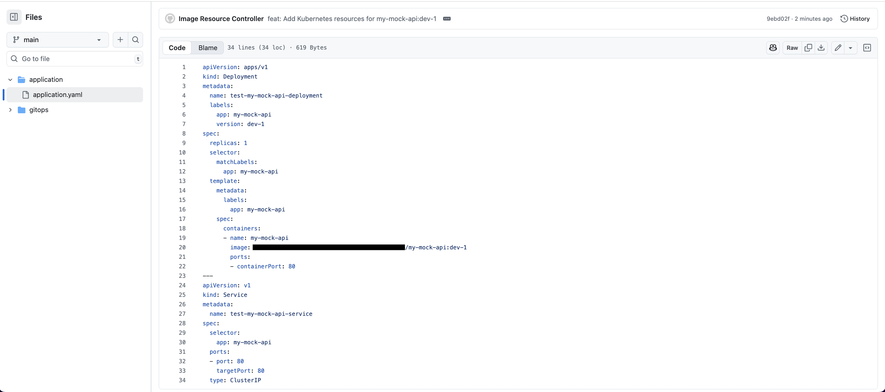
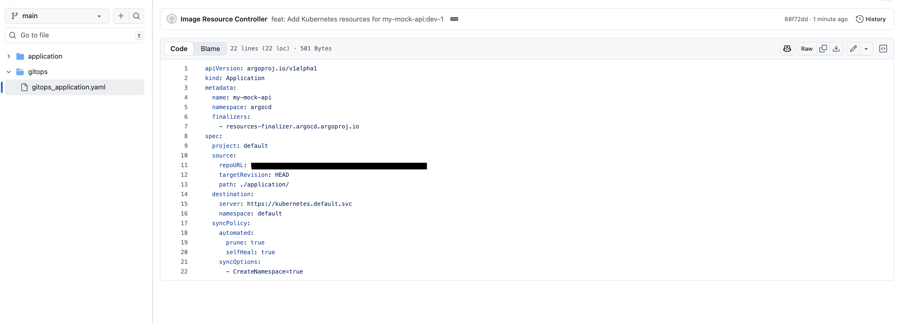

# Image Resource Controller with ArgoCD Sandbox

This repository demonstrates how to integrate [image-resource-controller](https://github.com/S-mishina/image-resource-controller) with ArgoCD using practical examples.

## Overview

This repository provides a comprehensive guide on how to use [image-resource-controller](https://github.com/S-mishina/image-resource-controller) with ArgoCD as an example implementation.

## Technologies & Use Case

**Stack:**

- [kind](https://kind.sigs.k8s.io/) - Local Kubernetes environment
- [ArgoCD](https://argo-cd.readthedocs.io/en/stable/) - GitOps continuous delivery
- [image-resource-controller](https://github.com/S-mishina/image-resource-controller) - Custom operator for automated resource generation
- [open-api-mock-build](https://github.com/S-mishina/open-api-mock-build) - Container image generation tool

**Goal:** Enable developers to deploy mock servers on Kubernetes by simply pushing container images, eliminating manual YAML creation.

## Architecture & Workflow

```mermaid
graph TB
    Dev[👨‍💻 Developer] --> |1 Push Image| ECR[📦 Container Registry<br/>ECR]
    ECR --> |2 Image Detection| IRC[🤖 image-resource-controller]
    IRC --> |3 Generate YAML| YAML[📄 Kubernetes Resources]
    IRC --> |4 Git Commit| Git[📚 Git Repository]
    Git --> |5 ArgoCD Sync| ArgoCD[🔄 ArgoCD]
    ArgoCD --> |6 Deploy| K8s[☸️ Kubernetes Cluster]
    
    Dev --> |7 Push New Version| ECR2[📦 New Image Version]
    ECR2 --> |8 Detect Update| AIU[🔍 Argo CD Image Updater]
    AIU --> |9 Update kustomization| Git
    Git --> |10 Auto Sync| ArgoCD
    
    subgraph "Initial Deployment Flow"
        ECR
        IRC
        YAML
    end
    
    subgraph "Update Flow"
        ECR2
        AIU
    end
    
    subgraph "GitOps Pipeline"
        Git
        ArgoCD
        K8s
    end
    
    classDef primary fill:#e1f5fe
    classDef secondary fill:#f3e5f5
    classDef success fill:#e8f5e8
    
    class ECR,ECR2 primary
    class IRC,AIU secondary
    class Git,ArgoCD,K8s success
```



**Key Benefits:**

- 🚀 **Zero Manual YAML**: Developers only push container images
- 📝 **Full GitOps Traceability**: All changes tracked through Git commits  
- 🔄 **Automatic Updates**: Smart detection and deployment of new versions
- 🛡️ **Duplicate Prevention**: Intelligent resource management

## Environment Setup

We'll use the Make commands from [image-resource-controller](https://github.com/S-mishina/image-resource-controller) to set up the environment, then install ArgoCD separately.

### 1. Repository Installation

```bash
git clone git@github.com:S-mishina/image-resource-controller.git
```

### 2. Environment Setup

```bash
 ❯ make kind-create
kind create cluster --name image-resource-controller
Creating cluster "image-resource-controller" ...
 ✓ Ensuring node image (kindest/node:v1.27.3) 🖼 
 ✓ Preparing nodes 📦  
 ✓ Writing configuration 📜 
 ✓ Starting control-plane 🕹️ 
 ✓ Installing CNI 🔌 
 ✓ Installing StorageClass 💾 
Set kubectl context to "kind-image-resource-controller"
You can now use your cluster with:

kubectl cluster-info --context kind-image-resource-controller

Not sure what to do next? 😅  Check out https://kind.sigs.k8s.io/docs/user/quick-start/
```

```bash
[kind-image-resource-controller|default] 
 ❯ make kind-dev
docker build -t image-detection-controller:latest -f Dockerfile.detection .
[+] Building 19.6s (17/17) FINISHED                                                   docker:desktop-linux
 => [internal] load build definition from Dockerfile.detection                                        0.0s
 => => transferring dockerfile: 1.32kB                                                                0.0s
 => [internal] load .dockerignore                                                                     0.0s
 => => transferring context: 197B                                                                     0.0s
 => [internal] load metadata for gcr.io/distroless/static:nonroot                                     1.5s
 => [internal] load metadata for docker.io/library/golang:1.23                                        2.9s
 => [builder 1/9] FROM docker.io/library/golang:1.23@sha256:60deed95d3888cc5e4d9ff8a10c54e5edc008c6a  0.0s
 => => resolve docker.io/library/golang:1.23@sha256:60deed95d3888cc5e4d9ff8a10c54e5edc008c6ae3fba618  0.0s
 => CACHED [stage-1 1/3] FROM gcr.io/distroless/static:nonroot@sha256:cdf4daaf154e3e27cfffc799c16f34  0.0s
 => [internal] load build context                                                                     0.0s
 => => transferring context: 93.01kB                                                                  0.0s
 => CACHED [builder 2/9] WORKDIR /workspace                                                           0.0s
 => CACHED [builder 3/9] COPY go.mod go.mod                                                           0.0s
 => CACHED [builder 4/9] COPY go.sum go.sum                                                           0.0s
 => CACHED [builder 5/9] RUN go mod download                                                          0.0s
 => CACHED [builder 6/9] COPY cmd/ cmd/                                                               0.0s
 => CACHED [builder 7/9] COPY api/ api/                                                               0.0s
 => [builder 8/9] COPY internal/ internal/                                                            0.0s
 => [builder 9/9] RUN CGO_ENABLED=0 GOOS=linux GOARCH=arm64 go build -a -o manager cmd/detection/ma  16.4s
 => [stage-1 2/3] COPY --from=builder /workspace/manager .                                            0.1s
 => exporting to image                                                                                0.1s
 => => exporting layers                                                                               0.1s
 => => writing image sha256:5b48c72eb1027dfcb317796dcd88e03124d737b7fa184e7c43b103e20373bc68          0.0s
 => => naming to docker.io/library/image-detection-controller:latest                                  0.0s

View build details: docker-desktop://dashboard/build/desktop-linux/desktop-linux/qasn74asam44tml3xoyukfjpt

What's Next?
  View a summary of image vulnerabilities and recommendations → docker scout quickview
docker build -t resource-creation-controller:latest -f Dockerfile.creation .
[+] Building 17.3s (17/17) FINISHED                                                   docker:desktop-linux
 => [internal] load build definition from Dockerfile.creation                                         0.0s
 => => transferring dockerfile: 1.32kB                                                                0.0s
 => [internal] load .dockerignore                                                                     0.0s
 => => transferring context: 197B                                                                     0.0s
 => [internal] load metadata for gcr.io/distroless/static:nonroot                                     0.4s
 => [internal] load metadata for docker.io/library/golang:1.23                                        0.4s
 => CACHED [stage-1 1/3] FROM gcr.io/distroless/static:nonroot@sha256:cdf4daaf154e3e27cfffc799c16f34  0.0s
 => [builder 1/9] FROM docker.io/library/golang:1.23@sha256:60deed95d3888cc5e4d9ff8a10c54e5edc008c6a  0.0s
 => => resolve docker.io/library/golang:1.23@sha256:60deed95d3888cc5e4d9ff8a10c54e5edc008c6ae3fba618  0.0s
 => [internal] load build context                                                                     0.0s
 => => transferring context: 2.38kB                                                                   0.0s
 => CACHED [builder 2/9] WORKDIR /workspace                                                           0.0s
 => CACHED [builder 3/9] COPY go.mod go.mod                                                           0.0s
 => CACHED [builder 4/9] COPY go.sum go.sum                                                           0.0s
 => CACHED [builder 5/9] RUN go mod download                                                          0.0s
 => CACHED [builder 6/9] COPY cmd/ cmd/                                                               0.0s
 => CACHED [builder 7/9] COPY api/ api/                                                               0.0s
 => CACHED [builder 8/9] COPY internal/ internal/                                                     0.0s
 => [builder 9/9] RUN CGO_ENABLED=0 GOOS=linux GOARCH=arm64 go build -a -o manager cmd/creation/mai  16.6s
 => [stage-1 2/3] COPY --from=builder /workspace/manager .                                            0.1s
 => exporting to image                                                                                0.1s
 => => exporting layers                                                                               0.1s
 => => writing image sha256:396a4e42ec2a37db56bb9e9f879bc0e509a08a9beb793ca9b8aa295a41a7b600          0.0s
 => => naming to docker.io/library/resource-creation-controller:latest                                0.0s

View build details: docker-desktop://dashboard/build/desktop-linux/desktop-linux/m4hoa1akeermb1wo2gdirupco

What's Next?
  View a summary of image vulnerabilities and recommendations → docker scout quickview
kind load docker-image image-detection-controller:latest --name image-resource-controller
Image: "image-detection-controller:latest" with ID "sha256:5b48c72eb1027dfcb317796dcd88e03124d737b7fa184e7c43b103e20373bc68" not yet present on node "image-resource-controller-control-plane", loading...
kind load docker-image resource-creation-controller:latest --name image-resource-controller
Image: "resource-creation-controller:latest" with ID "sha256:396a4e42ec2a37db56bb9e9f879bc0e509a08a9beb793ca9b8aa295a41a7b600" not yet present on node "image-resource-controller-control-plane", loading...
/Users/xxx/image-resource-controller/bin/controller-gen rbac:roleName=manager-role crd webhook paths="./..." output:crd:artifacts:config=config/crd/bases
/Users/xxx/image-resource-controller/bin/kustomize build config/controllers | kubectl apply -f -
namespace/image-resource-controller-system created
customresourcedefinition.apiextensions.k8s.io/imagedetecteds.automation.gitops.io created
customresourcedefinition.apiextensions.k8s.io/imageresourcepolicies.automation.gitops.io created
customresourcedefinition.apiextensions.k8s.io/resourcetemplates.automation.gitops.io created
serviceaccount/controller-manager created
role.rbac.authorization.k8s.io/leader-election-role created
clusterrole.rbac.authorization.k8s.io/imagedetected-editor-role created
clusterrole.rbac.authorization.k8s.io/imagedetected-viewer-role created
clusterrole.rbac.authorization.k8s.io/imageresourcepolicy-editor-role created
clusterrole.rbac.authorization.k8s.io/imageresourcepolicy-viewer-role created
clusterrole.rbac.authorization.k8s.io/manager-role created
clusterrole.rbac.authorization.k8s.io/metrics-auth-role created
clusterrole.rbac.authorization.k8s.io/metrics-reader created
clusterrole.rbac.authorization.k8s.io/resourcetemplate-editor-role created
clusterrole.rbac.authorization.k8s.io/resourcetemplate-viewer-role created
rolebinding.rbac.authorization.k8s.io/leader-election-rolebinding created
clusterrolebinding.rbac.authorization.k8s.io/manager-rolebinding created
clusterrolebinding.rbac.authorization.k8s.io/metrics-auth-rolebinding created
service/image-detection-controller-metrics-service created
service/resource-creation-controller-metrics-service created
deployment.apps/image-detection-controller created
deployment.apps/resource-creation-controller created
```

At this point, we have a complete Kubernetes environment with the controllers running.

### 3. ArgoCD Installation

```bash
❯ kubectl create namespace argocd
namespace/argocd created

❯ kubectl apply -n argocd -f https://raw.githubusercontent.com/argoproj/argo-cd/stable/manifests/install.yaml
customresourcedefinition.apiextensions.k8s.io/applications.argoproj.io created
customresourcedefinition.apiextensions.k8s.io/applicationsets.argoproj.io created
customresourcedefinition.apiextensions.k8s.io/appprojects.argoproj.io created
serviceaccount/argocd-application-controller created
serviceaccount/argocd-applicationset-controller created
# ... (additional ArgoCD resources created)
deployment.apps/argocd-server created
statefulset.apps/argocd-application-controller created
# ... (network policies created)
```

Reference: [ArgoCD Quick Start Guide](https://argo-cd.readthedocs.io/en/stable/#quick-start)

### 4. Git Integration & Base Application

```bash
kubectl apply -f configmap.yaml

kubectl create secret generic private-repo \
  -n argocd \
  --from-literal=type=git \
  --from-literal=url=https://github.com/sample_repo \
  --from-literal=password=$(gh auth token) \
  --from-literal=username=$(gh api user --jq .login)

kubectl label secret private-repo -n argocd argocd.argoproj.io/secret-type=repository

kustomize build argo_your_folder/ | kubectl apply -f -
```

> **⚠️ Security Notice**: This method is for demonstration purposes only. Use proper secret management in production.


## Integration Demo

### 1. Prerequisites - ECR Repository


### 2. Apply [image-resource-controller](https://github.com/S-mishina/image-resource-controller) CRDs

To use [image-resource-controller](https://github.com/S-mishina/image-resource-controller), you need AWS credentials and GitHub credentials.

Create the necessary secrets beforehand:

```bash
# AWS
kubectl create secret generic aws-credentials \
  --namespace=default \
  --from-literal=accessKeyId=xxx \
  --from-literal=secretAccessKey=xxx
```

> **⚠️ Production Warning**: Never use hardcoded credentials in production. Use proper secret management solutions.

```bash
# GitHub
kubectl create secret generic git-credentials \
  --namespace=default \
  --from-literal=token=xxx
```

> **⚠️ Production Warning**: Never use hardcoded credentials in production. Use proper secret management solutions.

Now that we've applied the sensitive information, let's apply the actual resources:

```bash
 ❯ kustomize build image-resource-controller_prd | kubectl apply -f -
imageresourcepolicy.automation.gitops.io/sandbox-image-resource-policy created
resourcetemplate.automation.gitops.io/sandbox-resource-template created
```

### 3. Execute [open-api-mock-build](https://github.com/S-mishina/open-api-mock-build)

As of 2025/08/14, to use [open-api-mock-build](https://github.com/S-mishina/open-api-mock-build), you need to clone the repository and run poetry build, so we'll clone the repository and execute the command.

```bash
 ❯ open-api-mock-build sample-api.yaml -i my-mock-api:dev-1 -r 123456789012.dkr.ecr.us-east-1.amazonaws.com
2025-08-15 00:34:59 [INFO] open_api_mock_build.main: OpenAPI Container Build Tool
2025-08-15 00:34:59 [INFO] open_api_mock_build.main: Spec file: sample-api.yaml
2025-08-15 00:34:59 [INFO] open_api_mock_build.main: Image: my-mock-api:dev-1
2025-08-15 00:34:59 [INFO] open_api_mock_build.main: Port: 3000
2025-08-15 00:34:59 [INFO] open_api_mock_build.main: Registry: 123456789012.dkr.ecr.us-east-1.amazonaws.com
2025-08-15 00:34:59 [INFO] open_api_mock_build.main: Push to registry: True
2025-08-15 00:34:59 [INFO] open_api_mock_build.main: Verbose: False
2025-08-15 00:34:59 [INFO] open_api_mock_build.main: Starting OpenAPI specification validation
2025-08-15 00:34:59 [INFO] open_api_mock_build.main: Successfully completed OpenAPI specification validation
2025-08-15 00:34:59 [INFO] open_api_mock_build.main: Starting container image build
2025-08-15 00:35:00 [INFO] open_api_mock_build.main: Successfully completed container image build
2025-08-15 00:35:00 [INFO] open_api_mock_build.main: Starting container image push
2025-08-15 00:35:45 [INFO] open_api_mock_build.main: Successfully completed container image push
2025-08-15 00:35:45 [INFO] open_api_mock_build.main: 🎉 All steps completed successfully!
```

### 4. Verification

```bash
 ❯ kubectl get imagedetected
NAME                         AGE
my-mock-api-dev-1-6c518827   2m59s
```

We can confirm that an imagedetected resource has been created.
Let's examine its contents:

```bash
 ❯ kubectl describe imagedetected my-mock-api-dev-1-6c518827
Name:         my-mock-api-dev-1-6c518827
Namespace:    default
Labels:       app.kubernetes.io/component=image-detected
              app.kubernetes.io/name=image-resource-controller
              automation.gitops.io/source=sandbox-image-resource-policy
Annotations:  automation.gitops.io/source-policy: sandbox-image-resource-policy
API Version:  automation.gitops.io/v1beta1
Kind:         ImageDetected
Metadata:
  Creation Timestamp:  2025-08-14T15:51:02Z
  Generation:          1
  Resource Version:    50446
  UID:                 f1dd1c48-0dc5-4956-89c8-e8a778a1e387
Spec:
  Detected At:      2025-08-14T15:34:56Z
  Full Image Name:  123456789012.dkr.ecr.us-east-1.amazonaws.com/my-mock-api:dev-1
  Image Digest:     sha256:6c51xxx
  Image Name:       my-mock-api
  Image Tag:        dev-1
  Source Policy:
    Name:       sandbox-image-resource-policy
    Namespace:  default
Status:
  Conditions:
    Last Transition Time:  2025-08-14T15:51:02Z
    Message:               Starting resource creation process
    Reason:                Processing
    Status:                True
    Type:                  Processing
    Last Transition Time:  2025-08-14T15:51:03Z
    Message:               Successfully created resources and committed to Git
    Reason:                Completed
    Status:                True
    Type:                  Ready
  Git Commit SHA:          9ebd
  Phase:                   Completed
  Processed At:            2025-08-14T15:51:03Z
  Resource Created:        true
Events:                    <none>
```

From this log we can see that it has been committed, so let's check the GitHub status.


We can confirm it has been committed, so let's look at the contents.





We can confirm that [image-resource-controller](https://github.com/S-mishina/image-resource-controller) has pushed to the corresponding repository.

Let's now check how ArgoCD is behaving.


When we push to GitHub, we can confirm that ArgoCD recognizes it.

When we sync this, the actual resources also get synced.


In this verification, because we're using kind, by default we can't pull from ECR and it fails.

```bash
 ❯ kubectl get pods
NAME                                           READY   STATUS             RESTARTS   AGE
test-my-mock-api-deployment-65f7774cdf-vz8nj   0/1     ImagePullBackOff   0
```

So we'll pull the image from ECR and use kind load to add the image to the cluster.

```bash
 ❯ kind load docker-image 123456789012.dkr.ecr.us-east-1.amazonaws.com/my-mock-api:dev-1 -n image-resource-controller
Image: "123456789012.dkr.ecr.us-east-1.amazonaws.com/my-mock-api:dev-1" with ID "sha256:72c1b4403b54fbce0e18b1edde53275fc2c52540db212e98d41a842890bcbc23" not yet present on node "image-resource-controller-control-plane", loading...
```


We can confirm that it actually gets synced.

## Advanced Integration: Argo CD Image Updater

Let's integrate [Argo CD Image Updater](https://argocd-image-updater.readthedocs.io/en/stable/) to handle automatic image updates.

### 1. Install [Argo CD Image Updater](https://argocd-image-updater.readthedocs.io/en/stable/)

```bash
kubectl get secret aws-credentials -n default -o yaml | \
  sed 's/namespace: default/namespace: argocd/' | \
  kubectl apply -f -
```

```bash
 ❯ kubectl apply -k argocd-image-updater/
serviceaccount/argocd-image-updater created
role.rbac.authorization.k8s.io/argocd-image-updater created
clusterrole.rbac.authorization.k8s.io/argocd-image-updater created
rolebinding.rbac.authorization.k8s.io/argocd-image-updater created
clusterrolebinding.rbac.authorization.k8s.io/argocd-image-updater created
configmap/argocd-image-updater-config created
configmap/argocd-image-updater-ssh-config created
secret/argocd-image-updater-secret created
deployment.apps/argocd-image-updater created
```

Reference: [Installation Guide](https://argocd-image-updater.readthedocs.io/en/stable/install/installation/)

### 2. Configure [Argo CD Image Updater](https://argocd-image-updater.readthedocs.io/en/stable/)

First, generate an ECR token:

```bash
export AWS_ACCOUNT_ID=$(aws sts get-caller-identity --query Account --output text)

```

```bash
kubectl create secret docker-registry ecr-registry-secret \
  --docker-server=${AWS_ACCOUNT_ID}.dkr.ecr.us-east-1.amazonaws.com \
  --docker-username=AWS \
  --docker-password=$(aws ecr get-login-password --region us-east-1) \
  --namespace=argocd
```

Next, create the ConfigMap:

```bash

cat << EOF | kubectl apply -f -
apiVersion: v1
kind: ConfigMap
metadata:
 name: argocd-image-updater-config
 namespace: argocd
data:
 registries.conf: |
   registries:
   - name: ECR
     api_url: https://${AWS_ACCOUNT_ID}.dkr.ecr.us-east-1.amazonaws.com
     prefix: ${AWS_ACCOUNT_ID}.dkr.ecr.us-east-1.amazonaws.com
     ping: yes
     credentials: secret:argocd/ecr-registry-secret#.dockerconfigjson
 log.level: debug
EOF

```

> **💡 Development Note**: This configuration is specific to kind clusters. In production, use proper registry authentication through service accounts or IAM roles.

Finally, restart argocd-image-updater:

```bash
kubectl rollout restart deployment/argocd-image-updater -n argocd
```

### 3. Modify Resources Pushed to [ArgoCD](https://argo-cd.readthedocs.io/en/stable/)

This involves modifying the repository you're using, so we can't write the details, but we'll make changes and push, showing only the diff here:

```bash
 ❯ git diff
diff --git a/gitops/gitops_application.yaml b/gitops/gitops_application.yaml
index 531e413..7cbaad8 100644
--- a/gitops/gitops_application.yaml
+++ b/gitops/gitops_application.yaml
@@ -5,6 +5,9 @@ metadata:
   namespace: argocd
   finalizers:
     - resources-finalizer.argocd.argoproj.io
+  annotations:
+    argocd-image-updater.argoproj.io/image-list: my-mock-api=123456789012.dkr.ecr.us-east-1.amazonaws.com/my-mock-api:dev-1
+    argocd-image-updater.argoproj.io/my-mock-api.update-strategy: "name"
+    argocd-image-updater.argoproj.io/my-mock-api.allow-tags: "regexp:^dev-[0-9]+$"
+    argocd-image-updater.argoproj.io/write-back-method: git
 spec:
   project: default
@@ -14,6 +14,7 @@ spec:
     repoURL: https://github.com/xxx
     targetRevision: HEAD
     path: ./application/
+    kustomize: {}
   destination:
     server: https://kubernetes.default.svc
     namespace: default
```

We'll also add kustomize support at this point:

```bash
 ❯ cat application/kustomization.yaml
apiVersion: kustomize.config.k8s.io/v1beta1
kind: Kustomization

resources:
  - application.yaml

images:
  - name: 123456789012.dkr.ecr.us-east-1.amazonaws.com/my-mock-api
    newTag: dev-1
```

```bash
 ❯ kubectl describe Application my-mock-api -n argocd
Name:         my-mock-api
Namespace:    argocd
Labels:       <none>
Annotations:  argocd-image-updater.argoproj.io/image-list: my-mock-api=123456789012.dkr.ecr.us-east-1.amazonaws.com/my-mock-api:dev-^1
              argocd-image-updater.argoproj.io/my-mock-api.update-strategy: semver
              argocd.argoproj.io/tracking-id: sample-app:argoproj.io/Application:argocd/my-mock-api
```

We can confirm it's been applied.

### 4. Execute [open-api-mock-build](https://github.com/S-mishina/open-api-mock-build)

Finally, let's create a new image tag:

```bash
open-api-mock-build sample-api.yaml -i my-mock-api:dev-2 -r 123456789012.dkr.ecr.us-east-1.amazonaws.com

2025-08-15 02:31:14 [INFO] open_api_mock_build.main: OpenAPI Container Build Tool
2025-08-15 02:31:14 [INFO] open_api_mock_build.main: Spec file: sample-api.yaml
2025-08-15 02:31:14 [INFO] open_api_mock_build.main: Image: my-mock-api:dev-2
2025-08-15 02:31:14 [INFO] open_api_mock_build.main: Port: 3000
2025-08-15 02:31:14 [INFO] open_api_mock_build.main: Registry: 123456789012.dkr.ecr.us-east-1.amazonaws.com
2025-08-15 02:31:14 [INFO] open_api_mock_build.main: Push to registry: True
2025-08-15 02:31:14 [INFO] open_api_mock_build.main: Verbose: False
2025-08-15 02:31:14 [INFO] open_api_mock_build.main: Starting OpenAPI specification validation
2025-08-15 02:31:14 [INFO] open_api_mock_build.main: Successfully completed OpenAPI specification validation
2025-08-15 02:31:14 [INFO] open_api_mock_build.main: Starting container image build
2025-08-15 02:31:16 [INFO] open_api_mock_build.main: Successfully completed container image build
2025-08-15 02:31:16 [INFO] open_api_mock_build.main: Starting container image push
2025-08-15 02:31:28 [INFO] open_api_mock_build.main: Successfully completed container image push
2025-08-15 02:31:28 [INFO] open_api_mock_build.main: 🎉 All steps completed successfully!
```

Let's check how [image-resource-controller](https://github.com/S-mishina/image-resource-controller) behaves:

```bash
 ❯ kubectl get ImageDetected -A
NAMESPACE   NAME                         AGE
default     my-mock-api-dev-1-6c518827   81m
default     my-mock-api-dev-2-6c518827   67s
```

```bash
 ❯ kubectl describe ImageDetected my-mock-api-dev-2-6c518827
Name:         my-mock-api-dev-2-6c518827
Namespace:    default
Labels:       app.kubernetes.io/component=image-detected
              app.kubernetes.io/name=image-resource-controller
              automation.gitops.io/source=sandbox-image-resource-policy
Annotations:  automation.gitops.io/source-policy: sandbox-image-resource-policy
API Version:  automation.gitops.io/v1beta1
Kind:         ImageDetected
Metadata:
  Creation Timestamp:  2025-08-14T17:31:30Z
  Generation:          1
  Managed Fields:
    API Version:  automation.gitops.io/v1beta1
    Fields Type:  FieldsV1
    fieldsV1:
      f:metadata:
        f:annotations:
          .:
          f:automation.gitops.io/source-policy:
        f:labels:
          .:
          f:app.kubernetes.io/component:
          f:app.kubernetes.io/name:
          f:automation.gitops.io/source:
      f:spec:
        .:
        f:detectedAt:
        f:fullImageName:
        f:imageDigest:
        f:imageName:
        f:imageTag:
        f:sourcePolicy:
          .:
          f:name:
          f:namespace:
    Manager:      manager
    Operation:    Update
    Time:         2025-08-14T17:31:30Z
    API Version:  automation.gitops.io/v1beta1
    Fields Type:  FieldsV1
    fieldsV1:
      f:status:
        .:
        f:conditions:
        f:phase:
        f:resourceCreated:
    Manager:         manager
    Operation:       Update
    Subresource:     status
    Time:            2025-08-14T17:31:30Z
  Resource Version:  67614
  UID:               f837cb9b-e325-4c0e-94b8-141aaa97d383
Spec:
  Detected At:      2025-08-14T15:34:56Z
  Full Image Name:  123456789012.dkr.ecr.us-east-1.amazonaws.com/my-mock-api:dev-2
  Image Digest:     sha256:6c5188274e30e79ce0eb438fb55c3a4d16e0617070e6a137493d4403ded03d4a
  Image Name:       my-mock-api
  Image Tag:        dev-2
  Source Policy:
    Name:       sandbox-image-resource-policy
    Namespace:  default
Status:
  Conditions:
    Last Transition Time:  2025-08-14T17:31:30Z
    Message:               Starting resource creation process
    Reason:                Processing
    Status:                True
    Type:                  Processing
    Last Transition Time:  2025-08-14T17:31:30Z
    Message:               Duplicate resource creation prevented - image already deployed
    Reason:                Completed
    Status:                True
    Type:                  Ready
  Phase:                   Completed
  Resource Created:        false
Events:                    <none>
```

Looking at the `Message`, it says `Duplicate resource creation prevented - image already deployed`.
[image-resource-controller](https://github.com/S-mishina/image-resource-controller) determines whether an image already exists in the actual environment and creates commits accordingly, so resources are not created in this case.

Instead, resource changes are made by [Argo CD Image Updater](https://argocd-image-updater.readthedocs.io/en/stable/).


By being pushed as shown above, ArgoCD is triggered.


## Conclusion

This sandbox demonstrates a complete GitOps workflow that automates container deployment from image registry to Kubernetes cluster. By integrating image-resource-controller with ArgoCD and Argo CD Image Updater, we've created a system that:

- **Eliminates Manual YAML Creation**: Developers only need to push container images
- **Provides Full GitOps Traceability**: All changes are tracked through Git commits
- **Enables Smart Resource Management**: Prevents duplicate deployments while allowing updates
- **Supports Continuous Delivery**: Automatically detects and deploys new image versions

The combination of these tools creates a powerful development workflow that bridges the gap between container image creation and Kubernetes deployment, making it easier for development teams to iterate quickly while maintaining proper GitOps practices.

This sandbox serves as a foundation that can be extended and customized for various use cases, from development environments to production deployments, always keeping security best practices and proper credential management in mind.
